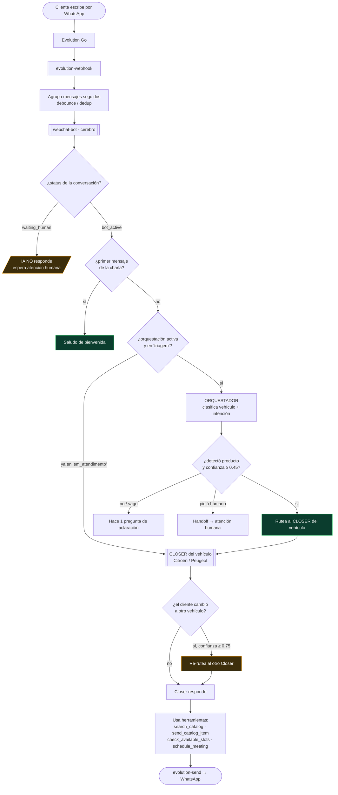

# Flujo de atención — Vendus (Automaq)

Cómo viaja un mensaje desde que el cliente escribe hasta que el agente responde, y **dónde aparece la fricción**.

## Diagrama del proceso



## Puntos de fricción detectados (estado al 17/6/2026)

| # | Síntoma que ve el cliente | Causa raíz | Estado |
|---|---|---|---|
| 1 | La IA no responde | `status = waiting_human` (venía de un handoff). El bot calla a propósito. | ✅ Se reactiva con botón **"Retomar"** o reset |
| 2 | Respuestas raras ("parece que hay un error") | **Historial viejo confuso** (mensajes migrados, errores, duplicados) que el modelo lee y repite | ⚠️ Usar **número nuevo** para tests / limpiar historial |
| 3 | El orquestador no ruteaba | Columna `products.is_active` **no existía** (drift código↔schema) → veía 0 productos | ✅ Corregido |
| 4 | "Voy a buscar las fotos…" y no llegan | Imágenes eran **URLs de citroen.com.py bloqueadas (403)** | ✅ Subir fotos propias al storage (hecho) |
| 5 | Tira horarios inventados ("mañana 10:30") | Prompt con ejemplo fijo + **sin `booking_event_types`** | ✅ Evento "Test Drive" creado + prompt reescrito (pregunta→verifica→confirma) |
| 6 | "No, no representamos Peugeot" (¡sí lo hacen!) | El **re-ruteo cross-producto** no se disparó: el Closer Citroën respondió en vez de derivar al Closer Peugeot | 🔴 **Pendiente** |
| 7 | Disponibilidad no se ve en la pantalla | Bug **visual** de frontend (los datos sí están guardados) | 🟡 Menor, pendiente |

## Estructura de agentes actual

```
Orquestador "Asistente Automaq"  (entrada, clasifica, barato — gpt-4o-mini)
   ├─ Closer Citroën   → info + cierre + test drive (C3, Aircross, Basalt, C4)
   ├─ Closer Peugeot   → info + cierre + test drive (208, 2008, 3008, 5008)
   └─ SDR Automaq      → fallback global
```
